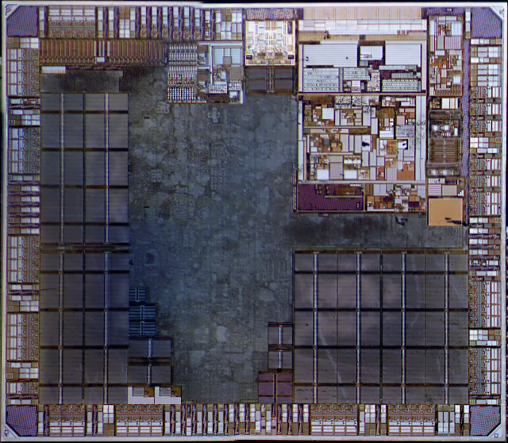
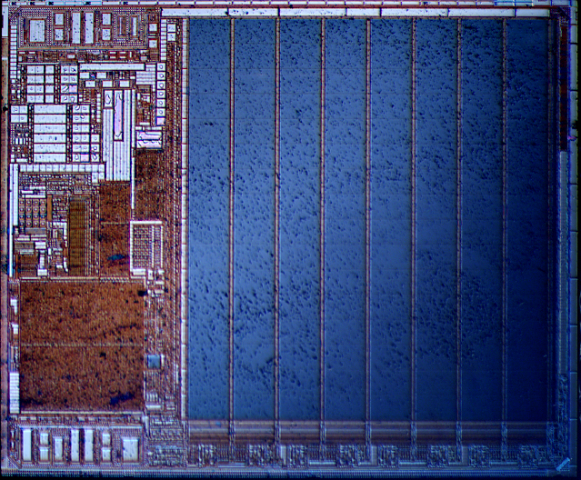

### mBusCh32Pico2
DIY Project for Ch32V00x w/ RPi PICO2

 

  
 
RPi RP2350 teardown under metal layer  
Dual Arm Cortex-M33 / dual Hazard3 RISC-V processors @ 150MHz w/ TSMC 40nm process  
   

 

References:
---
[Pi Pico 2 Extreme Teardown](http://youtube.com/user/electronupdate)
